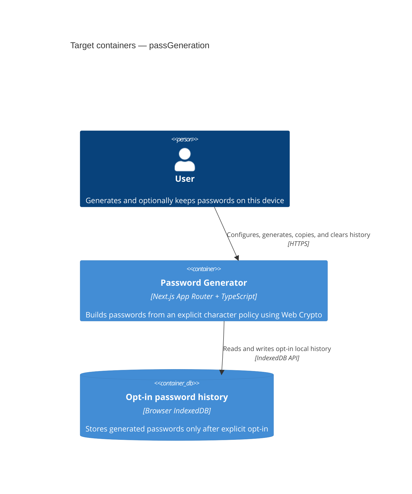

# Architecture map — passGeneration

> Target foundation for a greenfield browser password generator. The authored RexSoft baseline in
> `docs/architecture.md` remains authoritative; this map records the project-specific decisions that
> the scaffold will materialize.

## Stack

- Language / runtime: TypeScript in strict mode (`docs/architecture.md:3`, `docs/architecture.md:24`).
- Framework: Next.js App Router with React; package manager is pnpm (`docs/architecture.md:2-8`).
- Runtime shape: static/client-side web application. Password generation and persistence run only in the browser; there is no backend API, authentication, or server database (`docs/adr/0001-nextjs-client-side-stack.md`).
- Build / test / lint: `pnpm build`, `pnpm test`, and `pnpm lint`; Vitest + Testing Library cover logic and UI behavior, and Playwright provides a browser smoke test (`docs/adr/0001-nextjs-client-side-stack.md`).

## C4 — target foundation

## Module inventory

| Module | Target path | Layers | Wired at | Responsibility |
|---|---|---|---|---|
| Routes | `src/app/` | app | `docs/architecture.md:38-48` | Metadata, global styles, and thin composition of the generator screen. |
| Password domain | `src/entities/password/` | entities | `docs/architecture.md:56-61` | Character-set policy, complexity options, constraints, and framework-free types/constants. |
| Shared foundation | `src/shared/` | shared | `docs/architecture.md:56-66` | Web Crypto helper, IndexedDB adapter, generic UI primitives, utilities, and CSS tokens. |
| Generator UI | `src/view/widgets/PasswordGenerator/` | view | `docs/architecture.md:45-47` | Interactive generator, copy action, persistence opt-in, history, and clear-history behavior. |

`data/` and `providers/` are intentionally omitted until the application has an API or a genuine application-wide provider.

## Conventions

- **Layering:** imports flow `app → view → entities/shared`; lower layers never import higher ones (`docs/architecture.md:50-70`).
- **Route composition:** route files remain thin; product behavior lives outside React route components (`docs/architecture.md:76-81`).
- **Password generation:** use rejection sampling over `crypto.getRandomValues`; never use `Math.random`, modulo-biased selection, or server logging (`docs/adr/0001-nextjs-client-side-stack.md`).
- **Validation and errors:** reject impossible policies (for example, zero selected character groups) before generation and expose actionable inline UI errors; never persist an invalid result (`docs/adr/0002-rexsoft-layered-frontend.md`).
- **Persistence:** IndexedDB is local-only and opt-in; history is disabled by default, is never synchronized, and has a visible full-clear operation (`docs/adr/0003-indexeddb-opt-in-password-history.md`).
- **IDs:** persisted history entries use `crypto.randomUUID()` and include a creation timestamp (`docs/adr/0003-indexeddb-opt-in-password-history.md`).
- **Tests:** unit-test policy construction, required-group inclusion, unbiased index selection boundaries, and persistence behavior; add UI behavior tests and one Playwright generation/copy smoke test (`docs/adr/0001-nextjs-client-side-stack.md`).
- **Inter-module communication:** direct typed function calls and React props; no event bus or network transport (`docs/adr/0002-rexsoft-layered-frontend.md`).
- **UI / styling:** CSS Modules per widget/component with design tokens as CSS custom properties in `src/app/globals.css` (`docs/architecture.md:74-81`).

## Datastores

| Store | Engine | Accessed via | Notes |
|---|---|---|---|
| Opt-in password history | Browser IndexedDB | A typed adapter in `src/shared/lib/passwordHistory/` | Disabled by default; plaintext is device-local but remains readable by same-origin JavaScript; user can clear all records. |

## Frontend / UI foundation

- **Component library / design system:** small in-repository primitives under `src/shared/ui/`; no third-party component kit is required for the scaffold (`docs/architecture.md:81`).
- **Design tokens:** CSS custom properties in `src/app/globals.css`; concrete colors, spacing, radius, and typography are deferred to the product design stage (`docs/architecture.md:74-82`).
- **Styling approach:** CSS Modules for product UI plus global CSS variables for tokens (`docs/architecture.md:74-82`).
- **Shared primitives:** scaffold `Button`, `Checkbox`, `Range`, and `Switch` only as the generator UI needs them; domain-aware controls stay in `view/` (`docs/architecture.md:65-70`).
- **State / data-fetching:** local React state for the active policy; a typed IndexedDB adapter for opt-in history; no server-cache library.
- **Closest UI precedent:** none exists yet. The first generator widget becomes the project precedent and must be responsive at mobile, tablet, and desktop widths.

## Where things live / closest precedents

- Password policy and pure generation logic → `src/entities/password/` and `src/shared/lib/crypto/` according to the framework-free entity and reusable-infrastructure boundaries (`docs/architecture.md:65-81`).
- Generator controls and history UI → `src/view/widgets/PasswordGenerator/`; `src/app/page.tsx` only composes the widget (`docs/architecture.md:38-48`).
- Generic controls → `src/shared/ui/`; any component that imports password domain types stays in `view/` (`docs/architecture.md:65-70`).

## Constraints & known tech debt

- Persisted passwords are not encrypted in the MVP. The UI must explain that same-origin scripts can read them and must require explicit opt-in (`docs/adr/0003-indexeddb-opt-in-password-history.md`).
- No product design source or final token palette exists yet; scaffold structural tokens without inventing a branded design.
- The scaffolded project structure, test harnesses, IndexedDB adapter, and CI workflow now exist; the first product feature should extend the generator widget rather than replace the skeleton.
- `eslint.layers.mjs` is wired into `eslint.config.mjs`; `eslint-plugin-import` and `eslint-import-resolver-typescript` are installed and a forbidden-layer fixture was verified to fail lint (`docs/architecture.md:85-101`).

## Reconciliation with the authored architecture doc

The foundation follows `docs/architecture.md` for Next.js App Router, TypeScript, pnpm, source layout, and dependency direction. Project-specific deltas are deliberate: this application has no separate backend/API and does not create empty `data/` or `providers/` layers. Browser IndexedDB is the only persistence mechanism.
