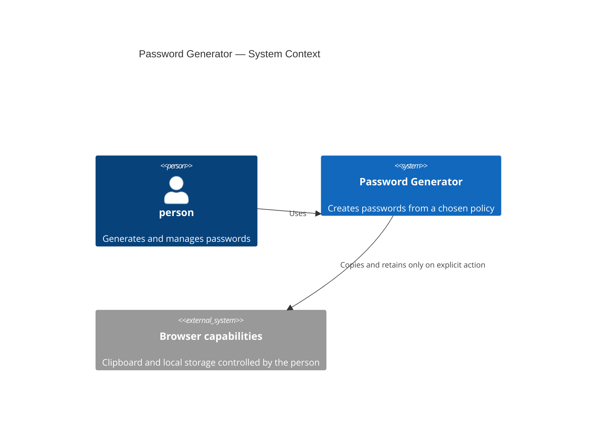
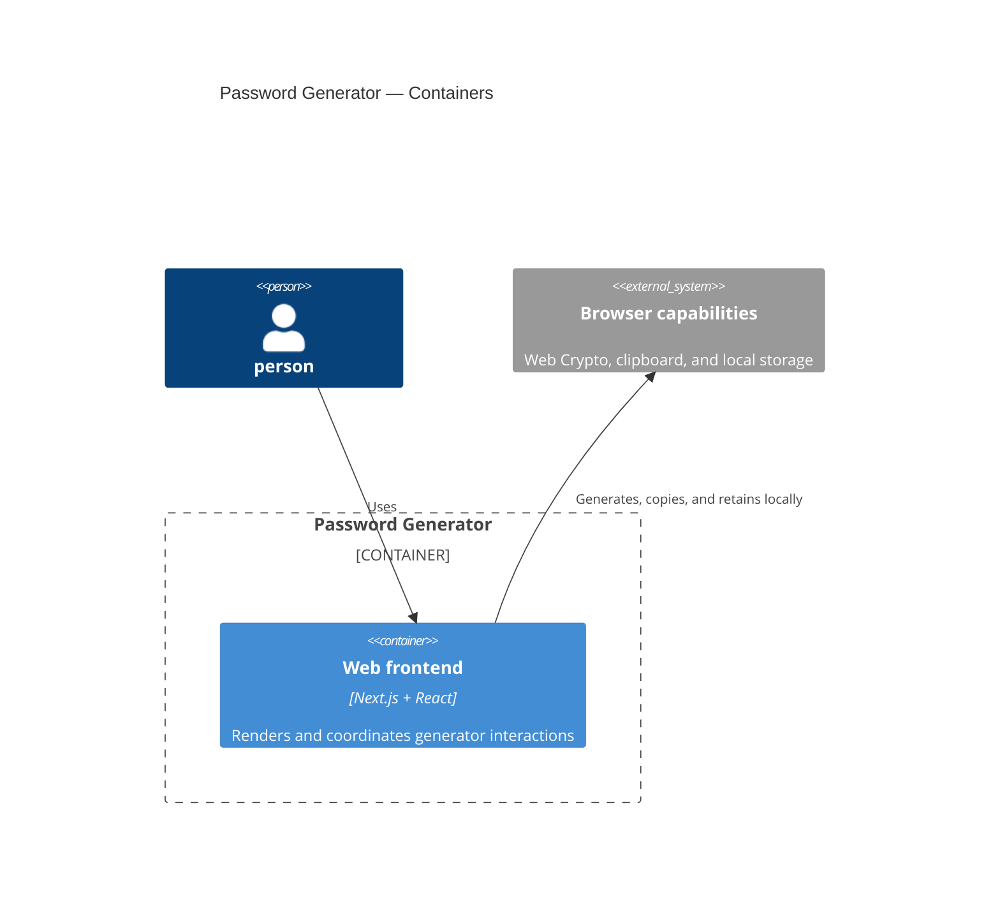
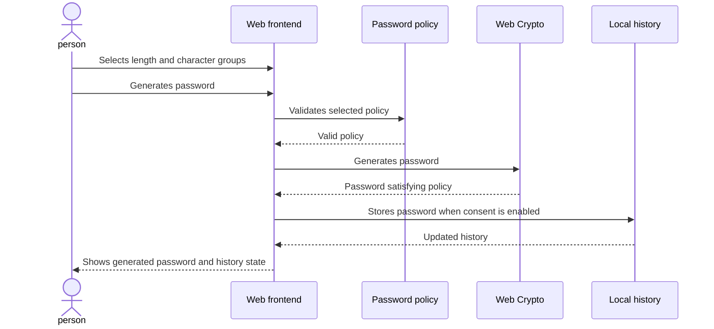
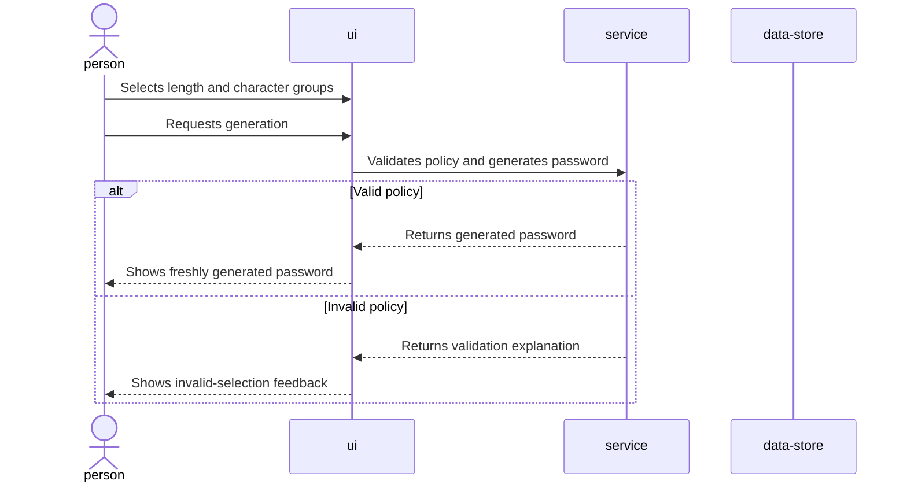
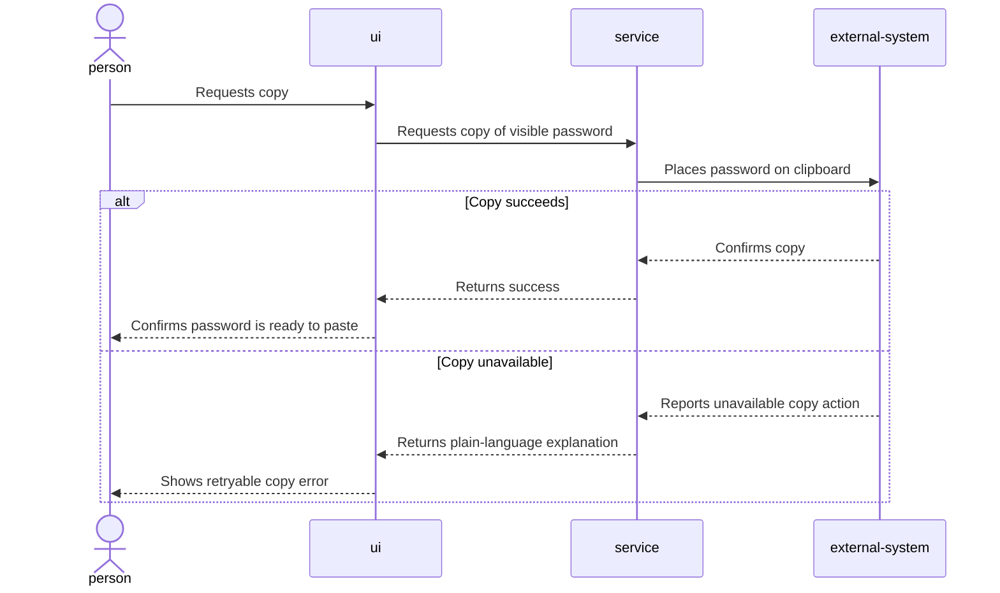
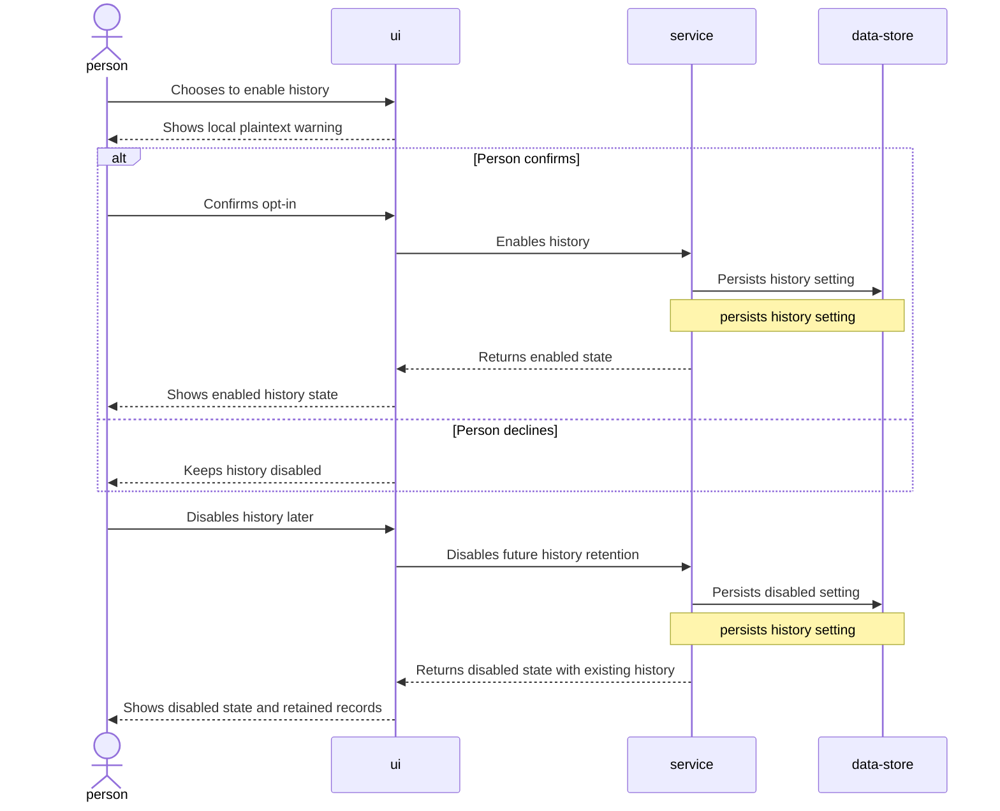
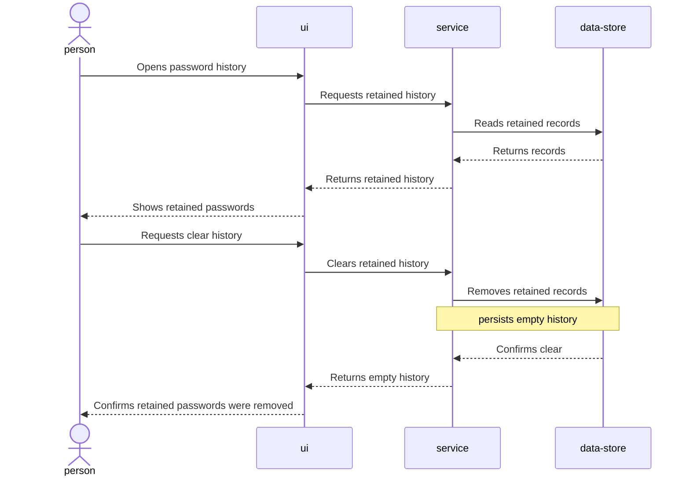

# Software Architecture Document — password-generator

## 1. Introduction and goals

**Intent.** Build a browser-based password generator for a person to select a length and character groups, generate and copy a compliant password, and optionally keep a local history under explicit consent.

**Top-3 quality goals:**

1. Policy correctness: every generated password satisfies the selected length and character-group invariant.
2. Privacy: password material stays on the device and history is disabled unless the person explicitly enables it.
3. Responsiveness: generation, copying, and local-history interactions meet the p95 targets in the feature specification.

**Stakeholders.**

| Role | Interest | Sign-off owner? |
|---|---|---|
| person | Generates, copies, retains, and clears passwords | No |
| Tech Lead | Architecture and quality gates | Yes |
| Security Lead | Local-password risk boundary | Yes |

## 2. Constraints

**Technical.**
- TypeScript 5.9, Next.js App Router 16.3, React 19.2, and pnpm 11.5.
- The feature is client-side; it has no backend API, account, or server database.
- Browser Web Crypto is the only acceptable source of password randomness.
- Local history uses the existing typed browser-storage adapter.

**Organisational.**
- S-sized, quick-route feature.
- Implementation is covered by unit, UI-behavior, and browser-smoke tests.

**Conventions.**
- Follow `docs/architecture.md`: thin `app`, domain types in `entities`, reusable infrastructure in `shared`, domain-aware UI in `view`.
- Server Components are default; the interactive generator is a narrow Client Component.
- CSS Modules plus CSS custom properties are the styling convention.

**Regulatory / external.**
- Generated passwords are confidential. No password material may be logged, transmitted, synchronized, or included in analytics.

## 3. Context and scope

The feature provides a local password-generation experience to a person in a browser. The system boundary ends at the browser: there are no third-party services, accounts, or remote stores.

<!-- brownfield: existing Next.js shell, password-domain placeholder, and typed local-history adapter are extended. -->

**External systems (in / out):**

| Actor or system | Type | Interaction |
|---|---|---|
| person | Person | Configures policy, generates, copies, and manages history |
| Browser clipboard | Browser capability | Receives copied password only after the person requests it |
| Browser local storage | Browser capability | Retains opted-in password history locally |

**C4 Context (L1):**



## 4. Solution strategy

1. **Use one web-frontend surface with a narrow client boundary.** The route composes a single interactive widget while the policy controls, clipboard action, and local-history controls run in the browser.
2. **Keep policy rules framework-free.** Password groups, validation, and generation contracts live below the UI so policy combinations can be tested without rendering components.
3. **Generate with Web Crypto and rejection sampling.** This preserves the project security constraint and avoids predictable or modulo-biased selection.
4. **Make history an explicit local-consent feature.** The widget obtains consent before saving, retains existing records after disabling, and exposes clear history.

## 5. Building block view

The feature follows the established layered frontend convention: `app` composes `view`; `view` consumes domain types from `entities` and reusable crypto, clipboard, and history utilities from `shared`.

**Internal decomposition:**

```text
src/
├── app/                                route composition and global styles
├── entities/password/                  policy types, constants, validation contracts
├── shared/lib/crypto/                  secure random selection and password generation
├── shared/lib/passwordHistory/         typed opted-in local-history adapter
├── shared/lib/clipboard/               browser clipboard boundary
└── view/widgets/PasswordGenerator/     interactive controls, result, consent, and history UI
```

**C4 Container (L2):**



## 6. Runtime view

**Critical flow 1: generate and retain an opted-in password**



**Critical flow 2: copy failure** — The web frontend keeps the generated password visible and shows a plain-language failure message when the browser cannot complete the requested copy action.

### Generate a password from a policy

The person selects a length and character groups, then the UI validates the policy before generation. A valid policy produces a password containing every selected group and no unselected groups; an invalid policy leaves the controls unchanged with plain-language feedback.



### Copy a generated password

The person requests copying only after a password is visible. The UI reports success when the browser accepts the copy action and keeps the password visible with an explanation when the action is unavailable.



### Enable, retain, and disable password history

The person explicitly enables history after reading the plaintext-local-storage warning. The UI stores generated passwords only while history is enabled; disabling prevents future storage but does not remove existing records.



### View and clear password history

The person can view records retained under earlier consent after returning to the application and can clear all records explicitly.



**Coverage map.** US-01, US-02, and US-03 plus AC-01, AC-02, and AC-04 are covered by “Generate a password from a policy”. US-04 plus AC-06 and AC-10 are covered by “Copy a generated password”. US-05 plus AC-03, AC-05, AC-08, and AC-09 are covered by “Enable, retain, and disable password history”. US-06 plus AC-07 are covered by “View and clear password history”.

## 7. Deployment view

<!-- N/A: reuses the existing Next.js Docker Compose web service; no new infrastructure or deployment unit is introduced. -->

## 8. Crosscutting concepts

| Concept | Convention | Where defined |
|---|---|---|
| Randomness | Web Crypto with rejection sampling; never `Math.random` | `docs/architecture-map.md` and ADR-0001 |
| Validation | Block zero selected groups, length outside 4–128, and lengths below selected-group count with plain-language feedback | `spec.md` AC-02 |
| Consent | Disabled by default; warn before enable; disabling stops future saves without deleting existing records | `spec.md` AC-03, AC-08, AC-09 |
| Privacy | Do not log, transmit, synchronize, or analyze password material | `spec.md` §6.1 |
| Errors | UI keeps the current state and gives plain-language feedback | `spec.md` AC-02 and AC-10 |
| IDs | History records use browser-generated UUIDs and creation timestamps | `docs/architecture-map.md` |

## 9. Architecture decisions

| # | Title | Status | Section |
|---|---|---|---|
| 0001 | Generate passwords with Web Crypto and rejection sampling | Accepted | §4 |
| 0002 | Retain password history only after explicit local consent | Accepted | §4 |

ADR files live under `docs/features/password-generator/adr/`.

## 10. Quality requirements

**QG-1. Policy correctness**
- **When:** a person generates a password from a valid policy.
- **Then:** 100% of tested valid policies satisfy their selected length and character groups.
- **How verify:** unit tests covering group combinations and boundary lengths.

**QG-2. Privacy and consent**
- **When:** a person has not enabled history or disables it after using it.
- **Then:** no new password is retained without consent; existing retained records remain until explicitly cleared.
- **How verify:** automated history tests for disabled, enabled, disabled-after-enabled, and clear states.

**QG-3. Responsiveness**
- **When:** a person generates, copies, or reads/writes local history.
- **Then:** p95 latency is ≤250 ms.
- **How verify:** browser-level automated measurements in the project test harness.

## 11. Risks and technical debt

| Risk / debt | Severity | Mitigation | Owner |
|---|---|---|---|
| Same-origin malicious scripts can read plaintext retained passwords | High | Explain the risk before opt-in, minimize dependencies, never transmit or log passwords, and provide clear-all history | Tech Lead |
| Browser clipboard can be unavailable | Medium | Keep the password visible and show a retryable plain-language error | Tech Lead |
| A shared device can expose retained records | Medium | History is opt-in, may be disabled, and has a clear-all action | person |

**Accepted debt (acceptable in v1, plan to fix later):**
- Retained passwords are not encrypted. A master-password vault requires separate recovery, locking, and key-management design.

## 12. Glossary

| Term | Meaning |
|---|---|
| person | Someone using the password generator in their browser without an account. |
| password history | A local, opt-in list of generated passwords; not a password manager or synchronized vault. |
| valid policy | A length from 4 through 128 with at least one selected group and enough length to include every selected group. |
| selected group invariant | Every selected group is represented in a generated password, while unselected groups are absent. |
